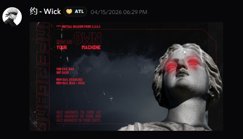
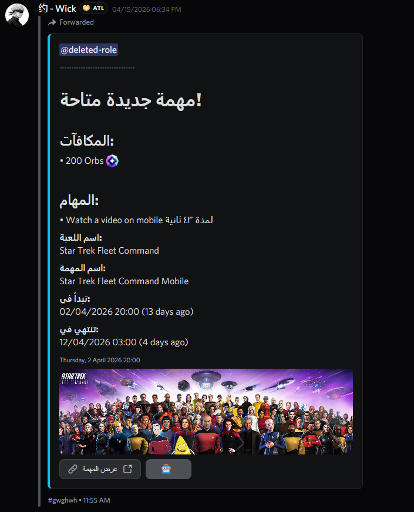
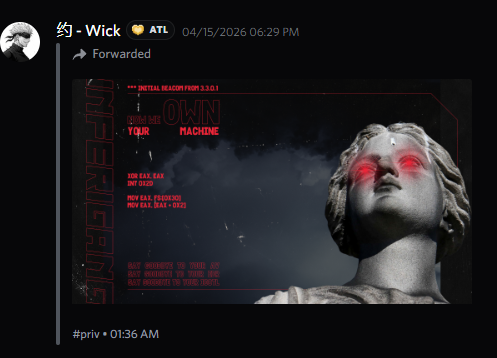
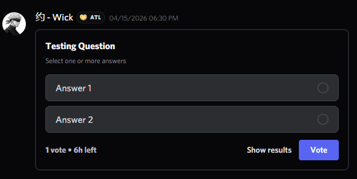
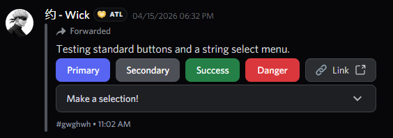
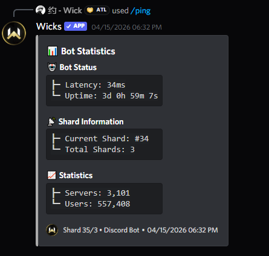

<div align="center">
  
  <h1>discord.js-html-transcript - Documentation</h1>
  <p><strong>The official documentation site for <a href="https://github.com/wickstudio/discord.js-html-transcript">discord.js-html-transcript</a></strong></p>
  <p>A premium, responsive, single-page documentation site built with vanilla HTML, CSS & JavaScript.</p>

  <br />

  <a href="https://demo.linkux.xyz"></a>
  <a href="https://www.npmjs.com/package/discord.js-html-transcript"></a>
  <a href="https://discord.gg/wicks"></a>
  <a href="./LICENSE"></a>
</div>

---

## About

This repository hosts the **official documentation website** for the [`discord.js-html-transcript`](https://github.com/wickstudio/discord.js-html-transcript) npm package - the most advanced library for generating beautiful, pixel-perfect Discord HTML chat transcripts.

The site covers everything developers need:

- **Getting Started** - Installation guides for npm, pnpm, and yarn
- **API Reference** - Full documentation for `createTranscript()`, `generateFromMessages()`, options, feature toggles, asset preservation, image compression, and callbacks
- **UI Showcase** - A gallery of 21+ pixel-perfect UI previews showing every supported Discord element
- **Live Demo** - An embedded, interactive transcript demo rendered directly in the browser

**🔗 Live Site:** [demo.linkux.xyz](https://demo.linkux.xyz)

---

## Site Features

| Feature | Description |
|---|---|
| 🎨 **Glassmorphism UI** | Frosted glass navbar, sidebar panels, and cards with layered backdrop blur effects |
| 🌀 **Animated Background** | Slowly drifting ambient glowing orbs that create a sense of depth |
| 🔤 **Premium Typography** | [Plus Jakarta Sans](https://fonts.google.com/specimen/Plus+Jakarta+Sans) for headings, [Inter](https://fonts.google.com/specimen/Inter) for body, [JetBrains Mono](https://fonts.google.com/specimen/JetBrains+Mono) for code |
| 📋 **Interactive Code Blocks** | Tabbed code blocks (npm / pnpm / yarn) with one-click copy-to-clipboard |
| 📑 **Dynamic Table of Contents** | Auto-generated right-side TOC with active section tracking via `IntersectionObserver` |
| 🖼️ **Image Lightbox** | Click any showcase preview image to zoom into a fullscreen overlay |
| 📱 **Fully Responsive** | Fluidly adapts from desktop (1440px+) → tablet (860px) → mobile (480px) with off-canvas sidebar |
| ♿ **Accessible** | ARIA attributes, keyboard navigation, and semantic HTML throughout |
| ⚡ **Zero Dependencies** | Pure vanilla HTML, CSS, and JavaScript - no build step, no frameworks |

---

## Project Structure

```
docs-discord.js-html-transcript/
├── assets/                  # Logo + 21 UI preview screenshots
│   ├── logo.png
│   ├── image-attachment.png
│   ├── embed-rich.png
│   ├── forwarded.png
│   ├── poll.png
│   └── ...
├── index.html               # Main documentation page
├── style.css                # Complete design system & responsive styles
├── script.js                # Interactive behavior (TOC, tabs, lightbox, sidebar)
├── demo.html                # Embedded live transcript demo
├── CNAME                    # Custom domain config (demo.linkux.xyz)
├── LICENSE                  # MIT License
└── README.md                # This file
```

---

## Local Development

No build tools required - just open the file in your browser:

```bash
# Clone the repository
git clone https://github.com/wickstudio/docs-discord.js-html-transcript.git
cd docs-discord.js-html-transcript

# Open in your default browser
start index.html        # Windows
open index.html         # macOS
xdg-open index.html     # Linux
```

Or use a simple local server for the best experience:

```bash
# Using Python
python -m http.server 8000

# Using Node.js
npx serve .
```

Then visit `http://localhost:8000` in your browser.

---

## Deployment

This site is deployed to **GitHub Pages** and served via the custom domain [`demo.linkux.xyz`](https://demo.linkux.xyz).

To deploy your own fork:

1. Push to your `main` branch
2. Go to **Settings → Pages** in your GitHub repository
3. Set the source to **Deploy from a branch** → `main` → `/ (root)`
4. *(Optional)* Add your custom domain in the `CNAME` file

---

## Showcase Previews

The documentation includes pixel-perfect previews of every Discord UI element the library supports:

<div align="center">
  <table>
    <tr>
      <td align="center"><br /><sub>Image Attachment</sub></td>
      <td align="center"><br /><sub>Rich Embed</sub></td>
      <td align="center"><br /><sub>Forwarded Message</sub></td>
    </tr>
    <tr>
      <td align="center"><br /><sub>Poll / Voting</sub></td>
      <td align="center"><br /><sub>Buttons & Menus</sub></td>
      <td align="center"><br /><sub>Slash & Voice</sub></td>
    </tr>
  </table>
</div>

---

## Related

| Repository | Description |
|---|---|
| [discord.js-html-transcript](https://github.com/wickstudio/discord.js-html-transcript) | The main npm library |
| [npm package](https://www.npmjs.com/package/discord.js-html-transcript) | Published on npm registry |
| [Wick Studio Discord](https://discord.gg/wicks) | Community & support server |

---

## License

This project is licensed under the **MIT License** - see the [LICENSE](./LICENSE) file for details.

---

<div align="center">
  <sub>Built with ❤️ by <a href="https://github.com/wickstudio">Wick Studio</a></sub>
</div>
